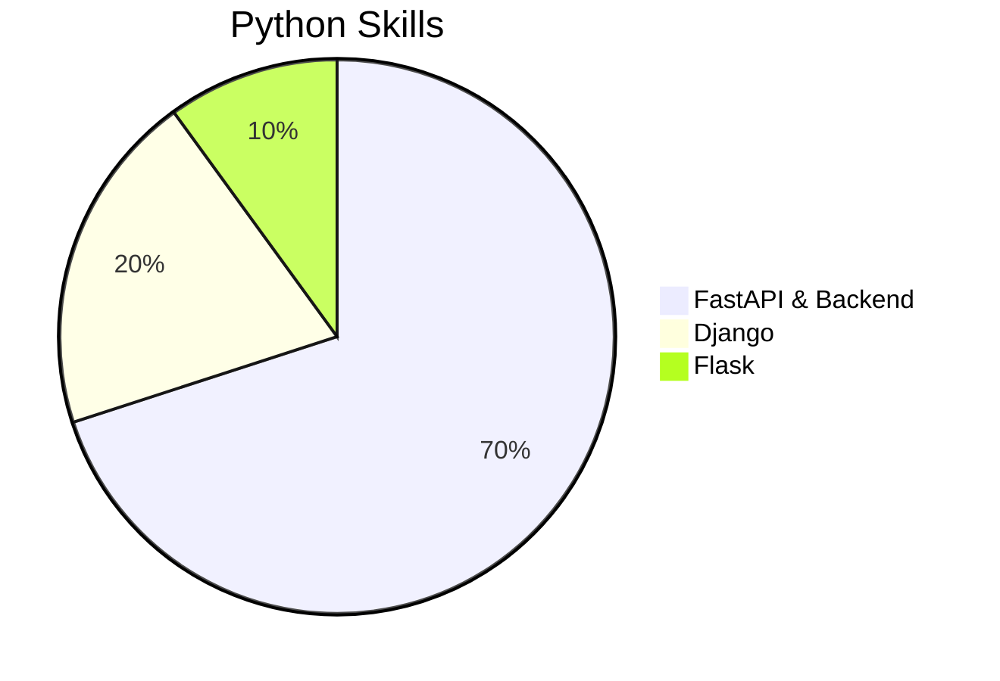
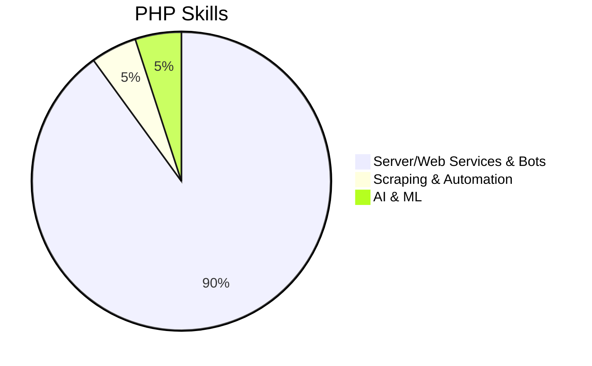

# Mehdi Ahmadi | GitHub Profile

      

---

# Hi! I'm **Mehdi Ahmadi** 👋
A passionate programmer born in **2006**. I love creating **web apps**, **APIs**, and **Telegram bots**. I started coding in **2020** and continuously explore new technologies.

### 🌟 About Me
- **Languages:** Python & PHP
- **Frameworks:** Django, Flask, FastAPI
- **Tools:** VS Code, Linux
- **Focus:** Backend development, automation, and secure scalable solutions

---

## 💻 Tech Stack

| Python | PHP | Flask | Django | FastAPI |
|--------|-----|-------|--------|--------|
|  |  |  |  |  |

| VS Code | Linux |
|---------|-------|
|  |  |

---

## 🚀 Skills

### Python Expertise

### PHP Expertise

---

## 📊 GitHub Stats

---

## 📫 Contact Me
- 🌐 **Website:** [api-free.ir](https://api-free.ir)
- 💬 **Telegram:** [@dev_jav](https://t.me/dev_jav)
- 🔗 **Rubika:** [server_dev](https://rubika.ir/server_dev)
- 📦 **PyPI:** [Codern_team](https://pypi.org/user/Codern_team)

---

✨ **Open to collaborations!** Feel free to reach out if you want to create **secure and scalable projects together**.

---

## 🔒 Security & Best Practices
I prioritize **clean code**, **data privacy**, and **secure programming practices** in all my projects. My focus is always on **maintainability**, **performance**, and **robust architecture**.

