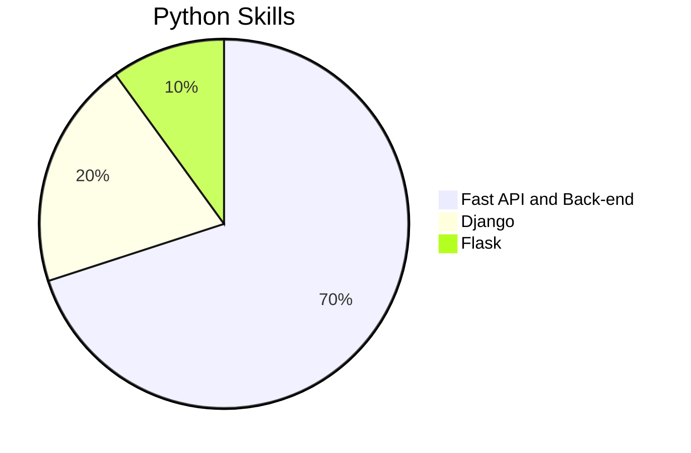
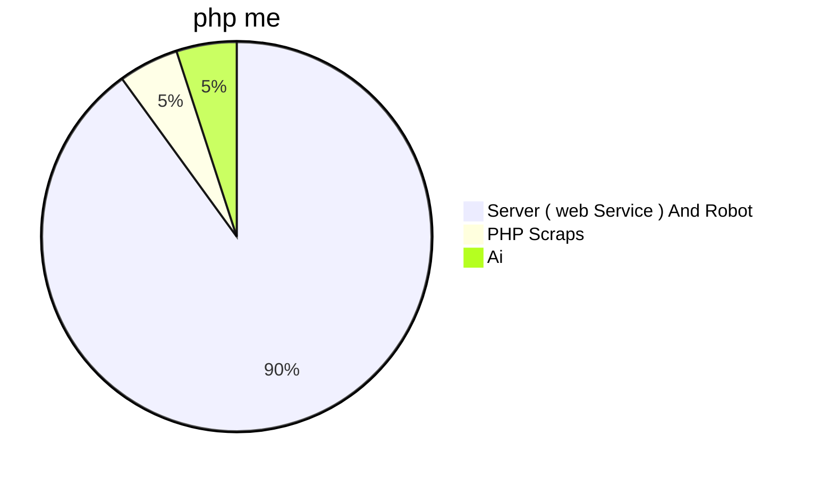

# 💻 Mahdi Ahmadi | Web & Software Developer  

👋 Hi! I'm **Mahdi Ahmadi**, a passionate developer from **Kermanshah**.  
I love coding and work in different fields, from web development to building APIs and Telegram bots!  

---

## 🚀 My Skills  

📌 My Projects
✅ api-free.ir - Free API service for developers
✅ Instagram Downloader Telegram Bot
✅ Project Management System with PHP & MySQL

📊 GitHub Activity

📫 Contact Me
🌐 Website: api-free.ir
💬 Telegram: @dev_jav
🔗 Rubika: server_dev
📦 PyPI: Codern_team

✨ Open to collaborations! Feel free to reach out!
